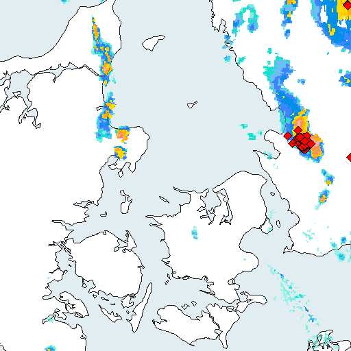

# Paraply
Use DMI radar to notify if it is going to rain in the next hour.
It is very similar to Dark Sky weather app, which was acquired
by Apple in 2020 and gone from the app store in 2023 
([Apple buys weather app Dark Sky | BBC](https://www.bbc.com/news/technology-52115095) 
and [Dark Sky is done | Mashable](https://mashable.com/article/dark-sky-apple-weather)).



> [!NOTE]
> Diagrams made with d2, do not show up in GitHub, as they currently
> are not built and stored in the repository (ignored in .gitignore).
> You can build them yourself using `make docs` after cloning if you
> have d2 on path. Information on how to install it can be found at 
> [d2lang.com](https://d2lang.com/tour/install).
> 
> A pre-commit hook already exists that builds them before commiting.
> If not then create `.git/hooks/pre-commit` with the contents
> ```
> #! /bin/sh
> exec -l make docs
> ```

## What

It checks your location and if it is going to rain soon according to
DMI, then it will notify you with e.g. "It is going to rain in 10
minutes -- remember your umbrella!"

DMI's radar states where it is raining and predicts the next hour in
5 minute increments. So concretely 

- if it rains within 30 minutes, you get a warning.
- it will always warn if it goes from not raining to raining in the
  next 5 minutes.
- use all data to create a widget (with 12 bars) that shows how much
  it is going to rain in the next hour.

## How


### Frontend

An early idea was to use PWA to simplify delivery. However because
*it is not possible to get location in the background*. As the entire
idea of the app is to notify you when it will rain soon without
requiring you to be in the app the entire time.

Developing a proper app will also allow to create widgets and whatnot.

---

It is developed in [flutter](https://flutter.dev/) such that it should easily be able to be
distributed to iOS. My focus is Android, but it would be nice if
both were supported.

### Backend

It is created in [go](https://go.dev/) and tested with [go-chi.io](https://go-chi.io/#/pages/testing).

# Notice on usage of LLMs
Some commits to this repository uses LLMs to write code. The specific model is the one provided by default by Gemini Code Assist in VS Code.

Commits featuring contributions by LLMs should state this.
